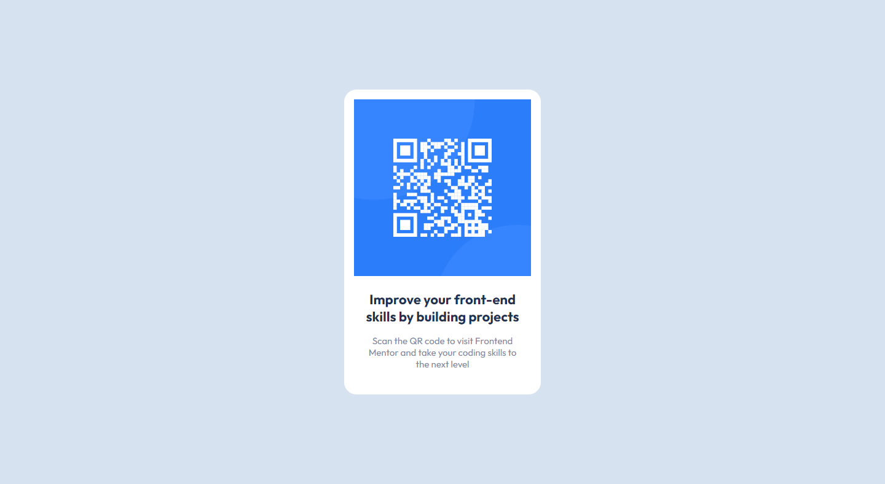

# Frontend Mentor - QR code component solution

This is a solution to the [QR code component challenge on Frontend Mentor](https://www.frontendmentor.io/challenges/qr-code-component-iux_sIO_H). Frontend Mentor challenges help you improve your coding skills by building realistic projects.

### Web Version

### Mobile Version

### Built with

- Semantic HTML5 markup
- CSS custom properties
- Flexbox

## 🚀 Starting

To start the project, just open the file `index.html` in your preferred browser.

## Author

- Linkedin - [Linkedin](https://www.linkedin.com/in/danielbarbosadefreitas/)
- Frontend Mentor - [@Danielhu3](https://www.frontendmentor.io/profile/Danielhu3)
